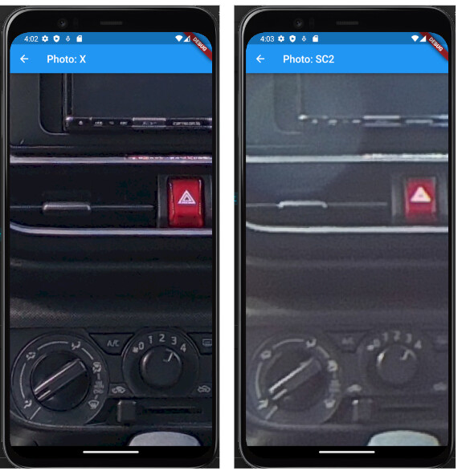
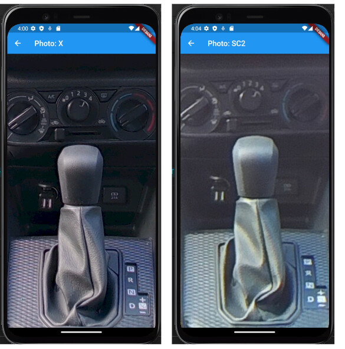
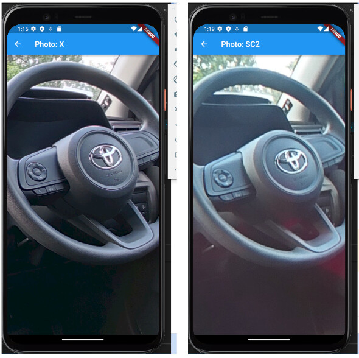
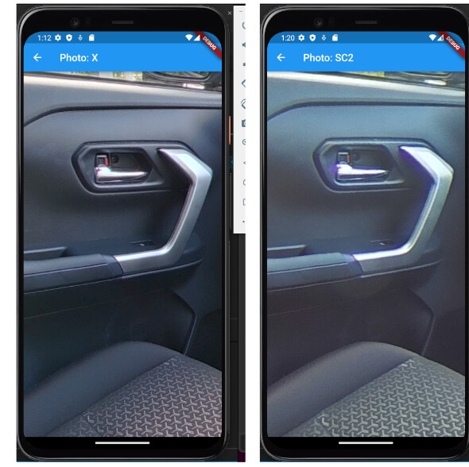

# Model Comparison

The THETA X can shoot an 11K image compared to the 5.4K image of the SC2.

To take advantage of the higher-resolution images of the THETA X,
developers may wish to optimize the viewer and enable zoom for
high-detail areas such as the climate control and media center.

<figure markdown>

<figcaption>5x zoom: THETA X (left) and THETA SC2 (right)
</figure>

## Original Images Used in Test

* [RICOH THETA X](https://drive.google.com/file/d/18sau30LQEdRpib4LrJSD4Eh9OMNJ00n7/view?usp=sharing)
11K, auto-HDR
* [RICOH THETA SC2](https://drive.google.com/file/d/14iCkb7XDoSiBml1ZDc-2q08dfvthTCUo/view?usp=sharing)
5.4K, auto-HDR

## 4x zoom

In the following example, both images are zoomed 4x. Developers
can enable pinch-to-zoom or set a preset zoom. This example
shows a preset zoom.

The client control knob features are easier to identify in the
THETA X (left image).

<figure markdown>

<figcaption>4x zoom: THETA X (left) and THETA SC2 (right)
</figure>

## 3x zoom

At 3x zoom, the differences are noticeable, but not as dramatic.
The difference in the lighting is partially due the HDR capability
of the THETA X.

<figure markdown>

<figcaption>3x zoom: THETA X (left) and THETA SC2 (right)
</figure>

## 2x zoom

The next set of examples show 2x zoom as a reasonable default zoom level for
navigation.

<figure markdown>

<figcaption>2x zoom: THETA X (left) and THETA SC2 (right)
</figure>

<figure markdown>

<figcaption>2x zoom: THETA X (left) and THETA SC2 (right)
</figure>

<figure markdown>

<figcaption>2x zoom: THETA X (left) and THETA SC2 (right)
</figure>

<figure markdown>

<figcaption>2x zoom: THETA X (left) and THETA SC2 (right)
</figure>