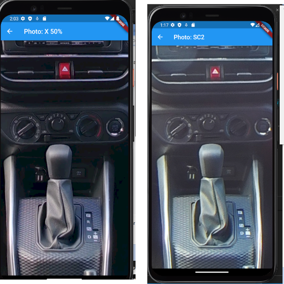
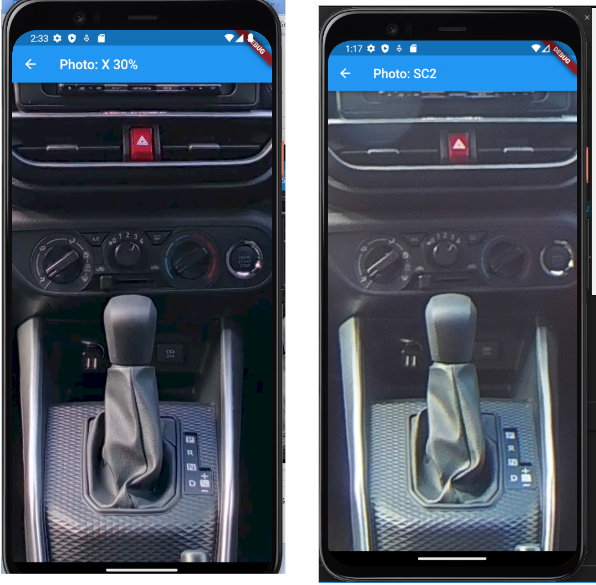
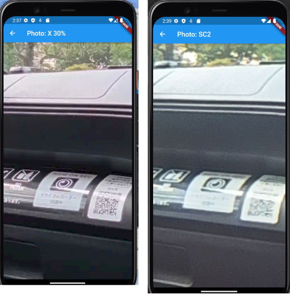

# Lossy Image Compression

RICOH THETA X 11K image, auto-HDR

| lossy compression | file size |
| ---------------   | ----------- |
| original JPEG | 11.2 MB |
| 50% quality, webp format | 2.0 MB |
| 30% quality, webp format | 1.4 MB |

## Original Images Used in Test

* [RICOH THETA X](https://drive.google.com/file/d/18sau30LQEdRpib4LrJSD4Eh9OMNJ00n7/view?usp=sharing)
11K, auto-HDR
* [RICOH THETA SC2](https://drive.google.com/file/d/14iCkb7XDoSiBml1ZDc-2q08dfvthTCUo/view?usp=sharing)
5.4K, auto-HDR

## 2MB 11K THETA X Image vs 4.2MB 5.4K SC2 Image

<figure markdown>

<figcaption>lossy compression: THETA X 2MB file size (left) and
THETA SC2 5.4K, 4.2MB file size(right)</figcaption>
</figure>

## 1.4MB 11K THETA X Image vs 4.2MB 5.4K SC2 Image

<figure markdown>

<figcaption>lossy compression: THETA X 1.4MB file size (left) and
THETA SC2 5.4K, 4.2MB file size(right)
</figcaption>
</figure>

## 3x zoom: 1.4MB 11K THETA X Image vs 4.2MB 5.4K SC2 Image

<figure markdown>

<figcaption>lossy compression: THETA X 1.4MB file size (left) and
THETA SC2 5.4K, 4.2MB file size(right)
</figcaption>
</figure>

<figure markdown>

<figcaption>lossy compression: THETA X 1.4MB file size (left) and
THETA SC2 5.4K, 4.2MB file size(right)
</figcaption>
</figure>

## metadata

metadata is preserved in the compression process to convert the
THETA X 11.2MB file into a 1.4MB file.

```text
ExifTool Version Number         : 12.40
File Name                       : X_30compressed.webp
Directory                       : .
File Size                       : 1350 KiB
File Modification Date/Time     : 2023:03:09 13:51:41-08:00
File Access Date/Time           : 2023:03:09 13:57:31-08:00
File Inode Change Date/Time     : 2023:03:09 13:51:41-08:00
File Type                       : WEBP
File Type Extension             : webp
MIME Type                       : image/webp
Profile CMM Type                : Little CMS
Profile Version                 : 4.3.0
Profile Class                   : Display Device Profile
Color Space Data                : RGB
Profile Connection Space        : XYZ
Profile Date Time               : 2023:03:09 21:49:38
Profile File Signature          : acsp
Primary Platform                : Apple Computer Inc.
CMM Flags                       : Not Embedded, Independent
Device Attributes               : Reflective, Glossy, Positive, Color
Rendering Intent                : Perceptual
Connection Space Illuminant     : 0.9642 1 0.82491
Profile Creator                 : Little CMS
Profile Copyright               : Public Domain
Media White Point               : 0.9642 1 0.82491
Chromatic Adaptation            : 1.04788 0.02292 -0.05022 0.02959 0.99048 
                                    -0.01707 -0.00925 0.01508 0.75168
Red Matrix Column               : 0.43604 0.22249 0.01392
Blue Matrix Column              : 0.14305 0.06061 0.71393
Green Matrix Column             : 0.38512 0.7169 0.09706
Chromaticity Channels           : 3
Chromaticity Channel 1          : 0.64 0.33002
Chromaticity Channel 2          : 0.3 0.60001
Chromaticity Channel 3          : 0.15001 0.06
Device Model Desc               : sRGB
VP8 Version                     : 0 (bicubic reconstruction, normal loop)
Image Width                     : 11008
Image Height                    : 5504
Exif Byte Order                 : Little-endian (Intel, II)
Bits Per Sample                 : 8 8 8
Make                            : RICOH
Camera Model Name               : RICOH THETA X
Orientation                     : Horizontal (normal)
X Resolution                    : 300
Y Resolution                    : 300
Resolution Unit                 : inches
Modify Date                     : 2023:03:09 13:51:24
Y Cb Cr Positioning             : Centered
Exposure Time                   : 1/13
F Number                        : 2.4
Exposure Program                : Program AE
ISO                             : 80
Sensitivity Type                : Standard Output Sensitivity
Exif Version                    : 0231
Date/Time Original              : 2022:08:23 16:50:02
Create Date                     : 2022:08:23 16:50:02
Offset Time                     : +09:00
Offset Time Original            : +09:00
Offset Time Digitized           : +09:00
Components Configuration        : Y, Cb, Cr, -
Exposure Compensation           : 0
Max Aperture Value              : 2.3
Metering Mode                   : Multi-segment
Light Source                    : Unknown
Flash                           : Unknown (0x32)
Focal Length                    : 1.4 mm
Flashpix Version                : 0100
Color Space                     : sRGB
Exif Image Width                : 11008
Exif Image Height               : 5504
Exposure Mode                   : Auto
White Balance                   : Auto
Scene Capture Type              : Standard
Sharpness                       : Normal
GPS Version ID                  : 2.3.0.0
GPS Latitude Ref                : North
GPS Longitude Ref               : East
GPS Altitude Ref                : Below Sea Level
GPS Time Stamp                  : 07:49:57
GPS Status                      : Measurement Active
GPS Measure Mode                : 3-Dimensional Measurement
GPS Dilution Of Precision       : 4.98
GPS Speed Ref                   : km/h
GPS Speed                       : 0.375
GPS Track Ref                   : Unknown ()
GPS Track                       : undef
GPS Img Direction Ref           : Magnetic North
GPS Map Datum                   : WGS-84
GPS Processing Method           : INT
GPS Date Stamp                  : 2022:08:23
XMP Toolkit                     : XMP Core 4.4.0-Exiv2
Format                          : image/webp
Api                             : 2.0
Time Stamp                      : 1678398701881200
Cropped Area Image Height Pixels: 5504
Cropped Area Image Width Pixels : 11008
Full Pano Height Pixels         : 5504
Full Pano Width Pixels          : 11008
Projection Type                 : equirectangular
Use Panorama Viewer             : True
Metadata Date                   : 2023:03:09T13:51:24:08:00
History Action                  : saved
History When                    : 2023:03:09 13:51:41-08:00
Aperture                        : 2.4
Image Size                      : 11008x5504
Megapixels                      : 60.6
Shutter Speed                   : 1/13
Create Date                     : 2022:08:23 16:50:02+09:00
Date/Time Original              : 2022:08:23 16:50:02+09:00
Modify Date                     : 2023:03:09 13:51:24+09:00
GPS Altitude                    : 5.8 m Below Sea Level
GPS Date/Time                   : 2022:08:23 07:49:57Z
GPS Latitude                    : 35 deg 35' 52.20" N
GPS Longitude                   : 139 deg 42' 22.15" E
Focal Length                    : 1.4 mm
GPS Position                    : 35 deg 35' 52.20" N, 139 deg 42' 22.15" E
Light Value                     : 6.5
```

## Demo of 1.4MB THETA X 11K Image

<figure markdown>

{ loading=lazy }
<figcaption>lossy compression: THETA X 1.4MB file size</figcaption>
</figure>
