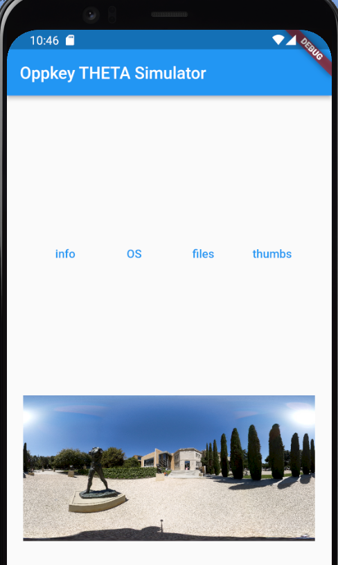

# Using theta-client with fake-theta


1. specify endpoint   `final String endpoint = 'https://fake-theta-alpha.vercel.app';`
2. initial `ThetaClientFlutter()` with the endpoint `await _thetaClient.initialize(endpoint);`

```dart
class MiniApp extends StatefulWidget {
  const MiniApp({Key? key}) : super(key: key);

  @override
  State<MiniApp> createState() => _MiniAppState();
}

class _MiniAppState extends State<MiniApp> {
  final _thetaClient = ThetaClientFlutter();
  String _mobilePlatform = 'device unknown';
  String _cameraInfo = 'unable to get camera info';
  // real camera
  // final String endpoint = 'http://192.168.1.1:80/';
  // Oppkey fake camera
  final String endpoint = 'https://fake-theta-alpha.vercel.app';

  @override
  void initState() {
    super.initState();
    _initializeTheta();
  }

  void _initializeTheta() async {
    try {
      var mobilePlatform = await _thetaClient.getPlatformVersion();
      await _thetaClient.initialize(endpoint);
      var thetaInfo = await _thetaClient.getThetaInfo();
```

## Compatibility between theta-client and fake-theta

As of July 5, 2023, there are several problems using theta-client
and fake-theta.  As a workaround, you can use standard http commands
and parse the response yourself.

Here is an example of using the http package in Flutter.

```dart
TextButton(
  onPressed: () async {
    // var imageList =
    //     await _thetaClient.listFiles(FileTypeEnum.image, 2);
    var url = Uri.parse('$endpoint/osc/commands/execute');

    var bodyMap = {
      'name': 'camera.listFiles',
      'parameters': {
        'fileType': 'image',
        'startPosition': 0,
        'entryCount': 1,
        'maxThumbSize': 0,
        '_detail': true,
      }
    };
    var bodyJson = jsonEncode(bodyMap);
    var response = await http.post(url,
        headers: {'Content-Type': 'application/json'},
        body: bodyJson);
    var imageUrl = jsonDecode(response.body)['results']
        ['entries'][0]['fileUrl'];

    setState(() {
      displayWidget = SingleChildScrollView(
        // child: Text(imageUrl.toString()),
        child: Image.network(imageUrl),
      );
    });
  },
  child: const Text('thumbs'),
),
```


