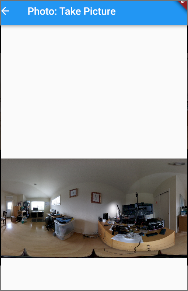
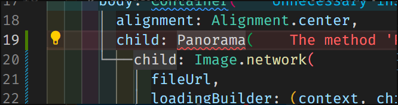
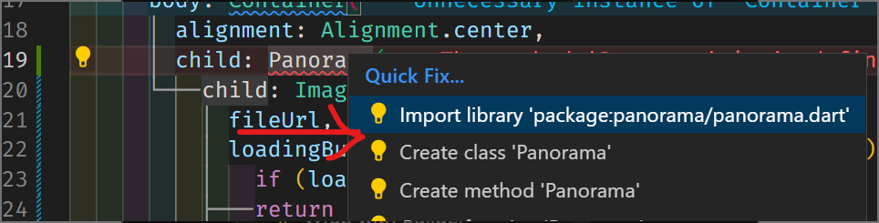
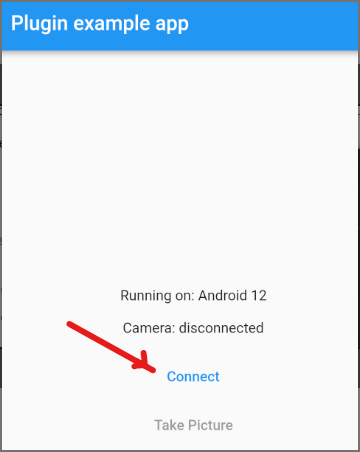

# Flutter

Official RICOH [demo-flutter](https://github.com/ricohapi/theta-client/tree/main/demos/demo-flutter)

## Community Video Tutorials

* [theta-client new Flutter App from the beginning - blank editor to Android app](https://youtu.be/EAwT2j0x5VU)
* [Equirectangular to 360 Image in Flutter  with Panorama Package](https://youtu.be/9hWUU6G3Ank)
 published February 21, 2023
* [RICOH theta-client Flutter Build on Windows](https://youtu.be/dJV5s46xFA0) - published Feb 8, 2023.

## Building a New App on Windows

1. build theta-client
1. copy `theta-client/kotlin-multiplatform/build/outputs/aar/*.aar` into
`theta-client/flutter/android/aar`
`theta-client/flutter/android/aar`
new Flutter project
1. create new Flutter project (example `theta_tutorial`)
1. copy `theta-client/flutter/*` into `theta_tutorial/packages/theta_client_flutter/`
1. add plugin to `pubspec.yaml`
1. set min sdk and dependency in `build.gradle` (Android)

## `pubspec.yaml` configuration

```yaml
dependencies:
  flutter:
    sdk: flutter
  theta_client_flutter:
    path: ./packages/theta_client_flutter
```

## `build.gradle` (Android)

in `theta_tutorial/android/app/build.gradle`

```groovy
dependencies {
    ...
    implementation files('../../packages/theta_client_flutter/android/aar/theta-client-debug.aar')
    ...
}
```

Set MinSdkVersion to 26

```groovy
MinSdkVersion 26
```

## Change Equirectangular Image to 360 Navigation View (Flutter)

Oppkey uses [panorama](https://pub.dev/packages/panorama).

[video tutorial](https://youtu.be/9hWUU6G3Ank)

After taking a picture, the post-view is also in equirectangular.



Add Panorama package.

```text

PS C:theta-client\demos\demo-flutter> flutter pub add panorama
Resolving dependencies...
```

Your dependencies will look like this:

```yaml
dependencies:
  flutter:
    sdk: flutter
  theta_client_flutter:
    path: ./packages/theta_client_flutter


  # The following adds the Cupertino Icons font to your application.
  # Use with the CupertinoIcons class for iOS style icons.
  cupertino_icons: ^1.0.2
  video_player: ^2.4.10
  panorama: ^0.4.1
```

In `lib/photo_screen.dart`, go to line 19 and wrap with Panorama.


If you don't have auto-import, the `Panorama` widget will initially
be red.



On VS Code, use ctrl-. to open up the auto-import menu.  



Hot restart

Select a file from list view.


View in 360.


## Build Flutter on Windows for Android

After building `theta-client`, inspect `theta-client/scripts/build-flutter-build.sh`

The key part is:

`cp -f ./kotlin-multiplatform/build/outputs/aar/*.aar ./flutter/android/aar/`

On PowerShell, copy the `*.aar` files into `./flutter/android/aar`

```text
```text
PS C:theta-client> copy .\kotlin-multiplatform\build\outputs\aar\*.aar .\flutter\android\aar\
PS C:theta-client> cd .\flutter\android\aar\
PS C:theta-client\flutter\android\aar> ls

    Directory: C:\Users\craig\Documents\Development\ricoh\2023\theta-client\flutter\android\aar


Mode                 LastWriteTime         Length Name
----                 -------------         ------ ----
-a----         2/24/2023  12:38 PM              0 .gitkeep
-a----         2/24/2023  12:40 PM         954368 theta-client-debug.aar
-a----         2/24/2023  12:40 PM         906203 theta-client-release.aar
```

In `demo-flutter\packages`, delete the file `theta_client_flutter` and replace
with a new folder called `theta_client_flutter`


Copy the contents `.\flutter` into the new `theta_client_flutter` folder.


In `demo-flutter`, run `flutter pub get`

```text
```text
PS C:theta-client\demos\demo-flutter> flutter pub get
Running "flutter pub get" in demo-flutter...
Resolving dependencies... (1.1s)
> async 2.10.0 (was 2.9.0)
> boolean_selector 2.1.1 (was 2.1.0)
  characters 1.2.1 (1.3.0 available)
> collection 1.17.0 (was 1.16.0) (1.17.1 available)
> js 0.6.5 (was 0.6.4) (0.6.7 available)
> matcher 0.12.13 (was 0.12.12) (0.12.14 available)
> material_color_utilities 0.2.0 (was 0.1.5)
  meta 1.8.0 (1.9.0 available)
  path 1.8.2 (1.8.3 available)
  plugin_platform_interface 2.1.3 (2.1.4 available)
> source_span 1.9.1 (was 1.9.0)
> stack_trace 1.11.0 (was 1.10.0)
> stream_channel 2.1.1 (was 2.1.0)
> string_scanner 1.2.0 (was 1.1.1)
> test_api 0.4.16 (was 0.4.12) (0.4.18 available)
> vector_math 2.1.4 (was 2.1.2)
  video_player 2.4.10 (2.5.2 available)
  video_player_android 2.3.10 (2.3.11 available)
  video_player_avfoundation 2.3.8 (2.3.9 available)
  video_player_platform_interface 6.0.1 (6.0.2 available)
  video_player_web 2.0.13 (2.0.14 available)
Changed 12 dependencies!
PS C:theta-client\demos\demo-flutter>
```

Start an Android emulator.

Run the Flutter application on the emulator.

```text
```text
PS C:theta-client\demos\demo-flutter> flutter run -d emulator-5554
Launching lib\main.dart on sdk gphone64 x86 64 in debug mode...
Running Gradle task 'assembleDebug'...                             80.8s
✓  Built build\app\outputs\flutter-apk\app-debug.apk.
Installing build\app\outputs\flutter-apk\app-debug.apk...        2,451ms
Syncing files to device sdk gphone64 x86 64...                     172ms
...
💪 Running with sound null safety 💪
```

Unless your computer is already connected to a RICOH THETA
camera, you will see _Initialize error_.  


Connect Windows computer to camera.




After pressing take picture, the live preview will appear.


## Troubleshooting

### Failed resolution of: Lcom/ricoh360/thetaclient/ThetaRepository; (Flutter, Android)

In `flutter_project_root/android/app/build.gradle`, specify `theta-client-debug.aar`
in the dependencies.

```groovy
dependencies {
    implementation "org.jetbrains.kotlin:kotlin-stdlib-jdk7:$kotlin_version"
    implementation files('../../packages/theta_client_flutter/android/aar/theta-client-debug.aar')

}
```
