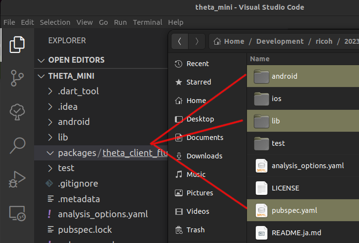
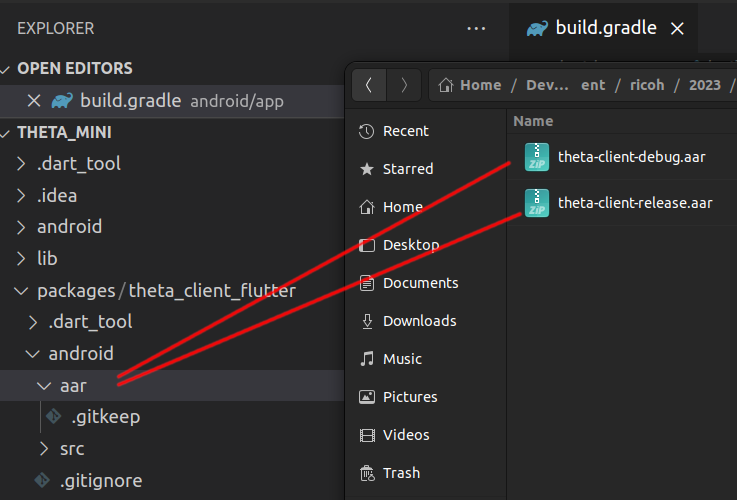
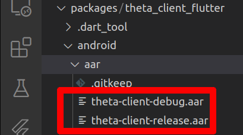

# New Flutter Android Project on Linux

Using theta-client v1.0.0.

## create new project

```text
flutter create --platforms=android -a kotlin theta_mini
Creating project theta_mini...
cd theta_mini/
mkdir packages
mkdir packages/theta_client_flutter
```

## copy theta-client package



## add theta-client to android

In `packages/theta_client_flutter/android/aar`, copy the `.aar` files
that were built in the theta-client package build step.

The aar files are in
`theta-client/kotlin-multiplatform/build/outputs`



This is what the aar files look like in VS Code.



## configure Flutter

In `pubspec.yaml`, add the theta-client package as a dependency.

```yaml
dependencies:
  flutter:
    sdk: flutter
  theta_client_flutter:
    path: ./packages/theta_client_flutter
```

## configure Android build

In `android/app/build.gradle`, make the following changes.

```groovy
if (flutterRoot == null) {
    throw new FileNotFoundException("Flutter not found. Add flutter.sdk in local.properties.")
}
...
...
defaultConfig {
    applicationId "com.oppkey.theta_mini"
    minSdkVersion 26
dependencies {
    implementation "org.jetbrains.kotlin:kotlin-stdlib-jdk7:$kotlin_version"
    implementation files('../../packages/theta_client_flutter/android/aar/theta-client-debug.aar')    
}    
```

## Test Flutter App


```dart
import 'package:flutter/material.dart';
import 'package:theta_client_flutter/theta_client_flutter.dart';

void main() {
  runApp(
    MaterialApp(
      home: Scaffold(
        appBar: AppBar(
          title: const Text('theta-client minimal'),
        ),
        body: const MiniApp(),
      ),
    ),
  );
}

class MiniApp extends StatefulWidget {
  const MiniApp({Key? key}) : super(key: key);

  @override
  State<MiniApp> createState() => _MiniAppState();
}

class _MiniAppState extends State<MiniApp> {
  final _thetaClient = ThetaClientFlutter();
  String _mobilePlatform = 'device unknown';
  String _cameraInfo = 'unable to get camera info';

  @override
  void initState() {
    super.initState();
    _initializeTheta();
  }

  void _initializeTheta() async {
    try {
      var mobilePlatform = await _thetaClient.getPlatformVersion();
      await _thetaClient.initialize();
      var thetaInfo = await _thetaClient.getThetaInfo();
      setState(() {
        _mobilePlatform = mobilePlatform ?? 'device unknown';
        _cameraInfo = '${thetaInfo.model}, FW ${thetaInfo.firmwareVersion},'
            'SN: ${thetaInfo.serialNumber}';
      });
    } catch (error) {
      debugPrint(error.toString());
    }
  }

  @override
  Widget build(BuildContext context) {
    return Padding(
      padding: const EdgeInsets.all(20.0),
      child: Column(
        mainAxisAlignment: MainAxisAlignment.start,
        children: [
          Text(
            'Mobile Platform: $_mobilePlatform',
            style: const TextStyle(fontSize: 36),
          ),
          const SizedBox(
            height: 40.0,
          ),
          Text(
            _cameraInfo,
            style: const TextStyle(fontSize: 36),
          )
        ],
      ),
    );
  }
}

```

## Troubleshooting

If the build fails, make sure you have the `aar` files accessible in
`packages/theta_client_flutter/android/aar`

```text
Launching lib/main.dart on sdk gphone64 x86 64 in debug mode...
main.dart:1

FAILURE: Build failed with an exception.

* What went wrong:
Execution failed for task ':app:checkDebugAarMetadata'.
> Could not resolve all files for configuration ':app:debugRuntimeClasspath'.
   > Failed to transform theta-client-debug.aar to match attributes {artifactType=android-aar-metadata}.
```
