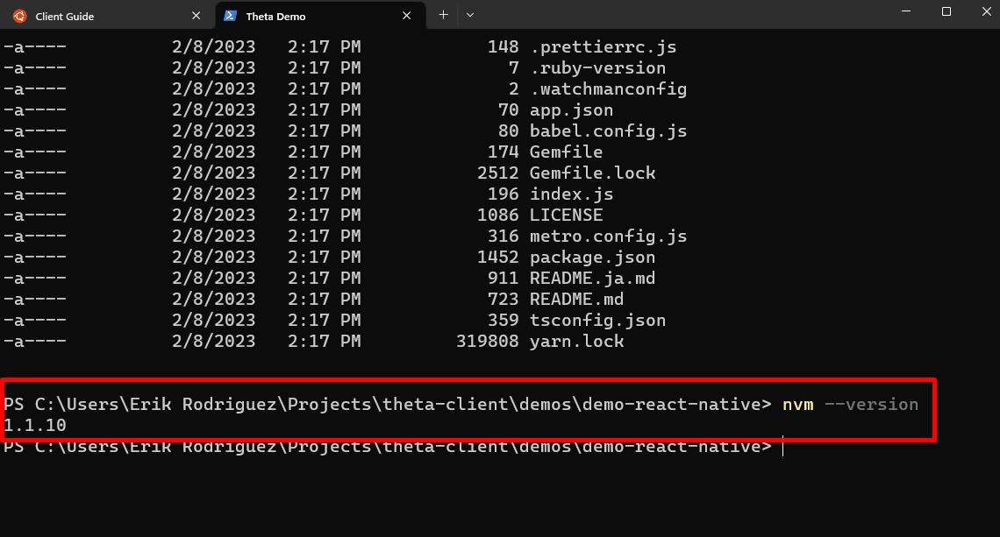

# How to Install Node.js on Windows

1. Download the nvm-setup.exe in the link below

    [NVM for Windows Download](https://github.com/coreybutler/nvm-windows/releases)

    

2. Run the nvm-setup.exe by clicking on it and follow the on screen setup instructions

3. Check if you installed NVM sucessfully by using the command `nvm --version`

    

4. To install **Node.js** with **nvm** you can now run `nvm install lts`
to install the long term support version of node

    

5. Check which versions of **node** you have then **use** it as shown with `nvm list` and then `nvm use` make sure you are in administrator mode

    

6. Check if node is working by running `node --version`

    
