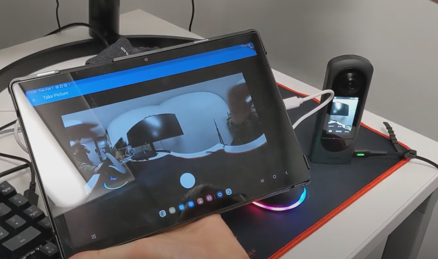

# Community Guide for theta-client



Full code on  [GitHub ricohapi/theta-client](https://github.com/ricohapi/theta-client).

## Quickstart

For iOS, see [this video](https://youtu.be/8moKIJ7f8kQ?feature=shared).

* [demo-android full build process video walkthrough](https://youtu.be/l8X6amOmHXI)

For iOS

```text
cd theta-client/demos/demo-ios
pod install
```

Open `SdkSample.xcworkspace` in Xcode.

Connect computer to RICOH THETA camera.

Press play inside of Xcode.

For Android, open in Android Studio and press play.

## Overview

`theta-client` is an open source library enabling rapid creation of mobile apps that control RICOH THETA cameras. The library works with Kotlin, Swift, Dart, and JavaScript.

## Demo Apps

Four open source demo applications are included:

* [Android native with Kotlin](https://github.com/ricohapi/theta-client/tree/main/demos/demo-android)
* [iOS native with Swift](https://github.com/ricohapi/theta-client/tree/main/demos/demo-ios)
* [React Native for iOS and Android builds](https://github.com/ricohapi/theta-client/tree/main/demos/demo-react-native)
* [Flutter for iOS and Android builds](https://github.com/ricohapi/theta-client/tree/main/demos/demo-flutter)

## Documentation

Refer to theta-client documentation for the development platform you are using.

* [Android](https://github.com/ricohapi/theta-client/blob/main/docs/tutorial-android.md)
* [iOS](https://github.com/ricohapi/theta-client/blob/main/docs/tutorial-ios.md)
* [React Native](https://github.com/ricohapi/theta-client/blob/main/docs/tutorial-react-native.md)
* [Flutter](https://github.com/ricohapi/theta-client/blob/main/docs/tutorial-flutter.md)

In addition to documentation on theta-client, you can refer to the
RICOH official [Web API 2.1 documentation](https://github.com/ricohapi/theta-api-specs/tree/main/theta-web-api-v2.1).

## Community Tips

### cannot find ANDROID_HOME (Android)

You may need to specify the path of ANDROID_HOME in either an
environmental variable or the `local.properties` file in the
project root.

Example `local.properties` on Linux.

`sdk.dir=/home/craig/Android/Sdk`

### zip END header not found (Android)

After you build theta-client, make sure that you copied
`theta-client-debug.aar` into `theta-client\demos\demo-android\app\libs`

### React Native: run pod install in ios folder

For React Native, you may need to run `pod install` in the ios
folder inside of demo-react-native

### minSdkVersion (Android)

If you build a new project, the `minSdkVersion` might be set
to a lower number such as 16.  The plug-in requires a `minSdkVersion` of 26.

In `android/app/build.gradle`, set to `minSdkVersion 26`

## Getting Help

Open an [issue on GitHub](https://github.com/ricohapi/theta-client/issues).
