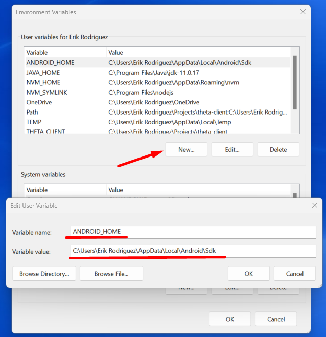
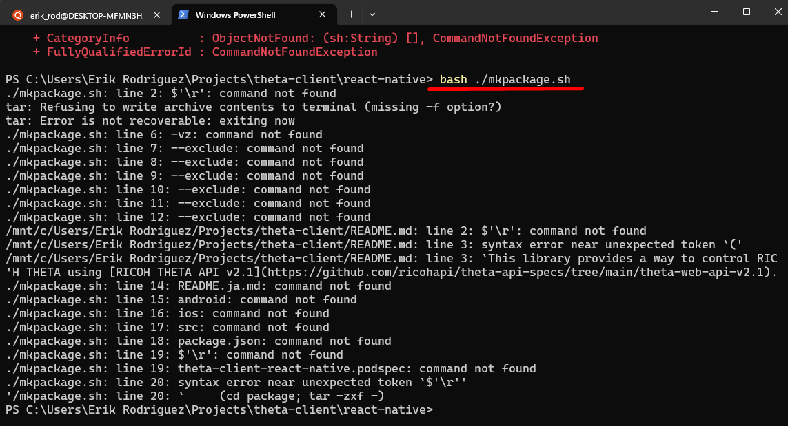
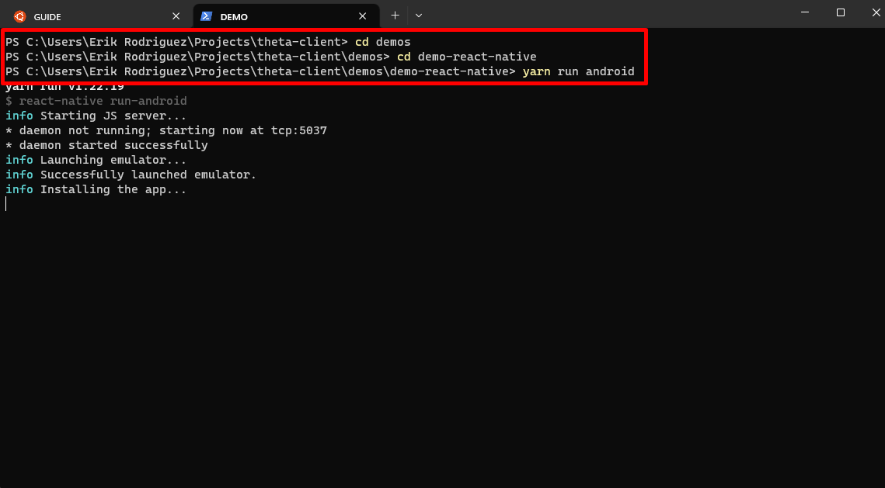
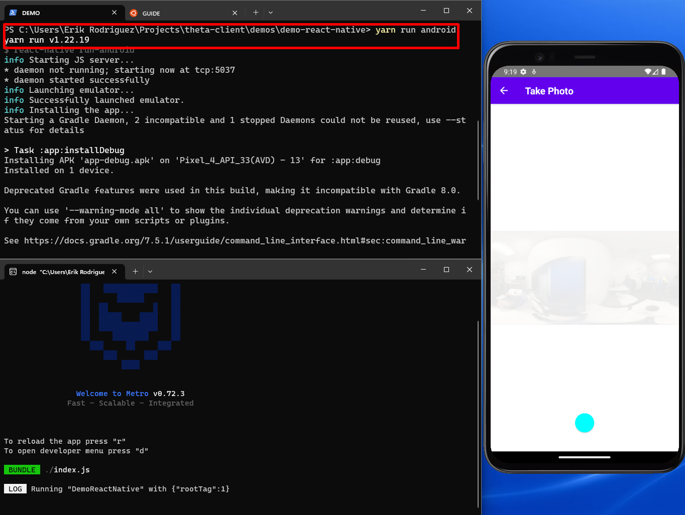
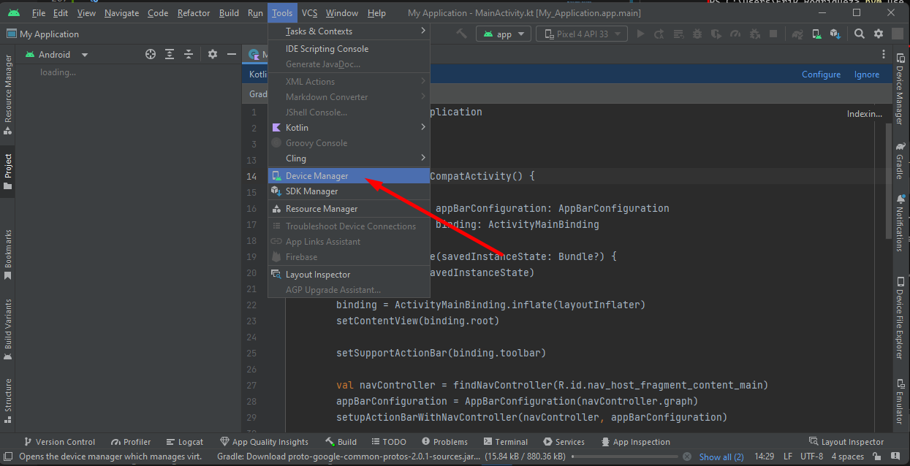
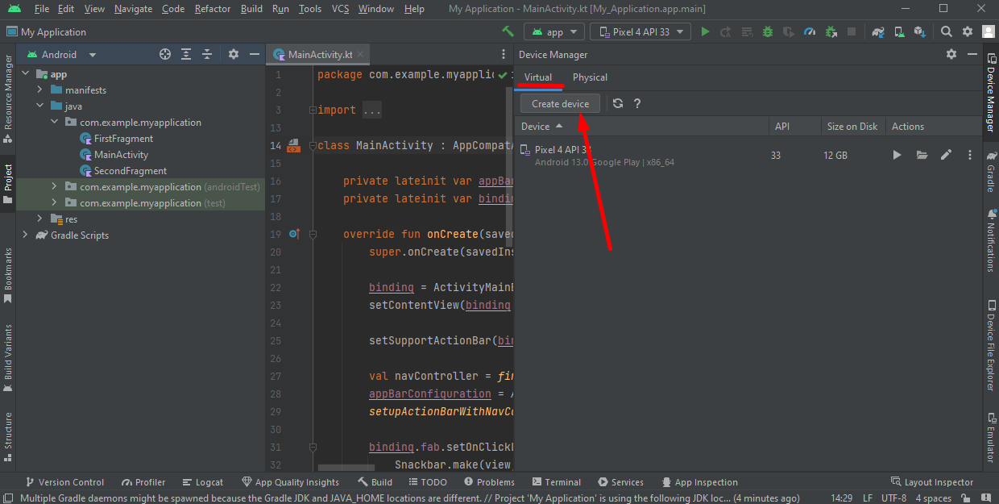
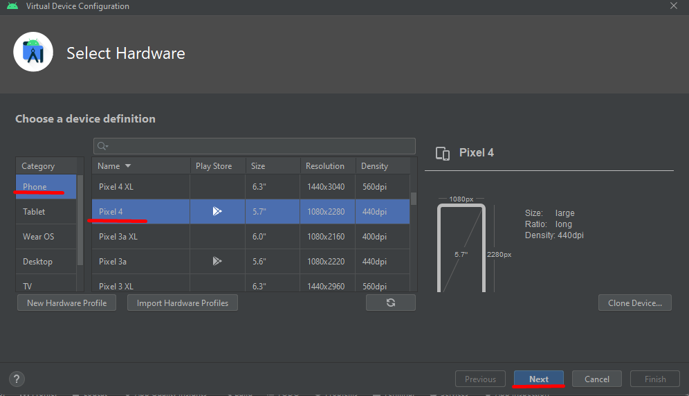

# React Native RICOH THETA Demo Installation Guide for Windows

## Overview

This section covers the installation process for React Native on **Windows 11** so that we can run the `demo-react-native`.
Another section will cover the installation for macOS.

For this installation you will need to install **Node.js** if you haven't already.

There will be videos and links in the resource section for the installation of node.js on your computer. This article also covers how to build the `theta-client` and make it available to `demo-react-native`, as well as building the `demo-react-native` and running it on an Android emulator.

The results will be shown using the **THETA X** running the `demo-react-native`  using the THETA API.

## General Steps to run React Native Demo on Windows

1. Build the `theta-client` and make it available to `demo-react-native`
2. Build `demo-react-native`
3. Test the `demo-react-native` build on **THETA X** with an emulator
4. Test all demo features: List Files, Take Photo

## Resources

* [GITHUB React Native demo for theta-client](https://github.com/ricohapi/theta-client/tree/main/demos/demo-react-native)

* [VIDEO theta-client React Native full build tutorial and demonstration](https://www.youtube.com/watch?v=SqzDomDikcM)

* [VIDEO HowTo Install nvm, node, npm and yarn on Windows 11](https://www.youtube.com/watch?v=NWUfaXFPv50)

## Work Environment

| Dell XPS 13 | Details                              |
| ----------- | ------------------------------------ |
| CPU         | Intel(R) Core(TM) i7-10710U CPU @ 1.10GHz   1.61 GHz  |
| RAM         | 16.0 GB |
| OS          | Windows 11 Home |

* THETA X running firmware 1.41.0

## Requirements

* [Android Studio](https://developer.android.com/studio)

  * Needed for the SDK and [Emulator Setup](#how-to-setup-the-android-emulator)

* [Java 11](https://www.oracle.com/java/technologies/javase/jdk11-archive-downloads.html)

* [Node JS](https://github.com/coreybutler/nvm-windows)

  * Recommend to Install with NVM for Windows. Process is shown below in [Node JS Section](#how-to-install-nodejs-on-windows).

## Command Line Steps

### First Command - Clone the Repo

with  `git clone https://github.com/ricohapi/theta-client.git`

### Second Command -  Go into  **theta-client** directory

with `cd theta-client`

### Third Command - Build Gradlew

with `./gradlew publishToMavenLocal podPublishXCFramework` but I have an Error, the problem is the SDK location is not found. My solution is to set the environment variable of the SDK.

## Steps to Fix for Build Failure

1. Search for env

    

2. Click on environmental variables

    

3. New User Variable and Type in the Variable name `ANDROID_HOME` and set the path `C:\Users\UserName\AppData\Local\Android\Sdk`

    

    By default the path to the SDK usually is `C:\Users\UserName\AppData\Local\Android\Sdk` , Copy the Path substituting for your `UserName`

    

4. Restart your terminal by closing and relaunching it before trying out the `gradlew` build command again

## Command Line Steps Continued

Retry Third Command - Try the Build Gradlew command again `./gradlew publishToMavenLocal podPublishXCFramework`

Screenshot below shows its successful

### Fourth Command - Set the environment variable of THETA_CLIENT

with the process shown above using the Windows Environment Variable Editor.

`Variable Name : THETA_CLIENT`

`Variable Path : C:\Users\Erik Rodriguez\Projects\theta-client`

Substitute the variable path for your local path to `theta-client`

Check if it sucessfully set the variable with `echo $Env:THETA_CLIENT` it should return the path of the THETA_CLIENT variable if set correctly

### Fifth Command - Go into **react-native** directory

with `cd react-native`

### Sixth Command - run `bash ./mkpackage.sh`

and as it appears we have errors to fix

To fix the mkpackage error:

You need to Convert your file to Unix format. This is one way to do it and there may be other ways.

1. Open up the VSCode editor, install it if you don't have it

2. Open the file called `mkpackage.sh` in the `theta-client\react-native` directory

3. Convert the `mkpackage.sh` file `CRLF` to `LF` by clicking on the bottom right `CRLF` button and changing it to `LF` as shown

    

4. Save the file by pressing `ctrl-s` and you should be good to go!

Retry Sixth Command - run `bash ./mkpackage.sh`

Go into the `demo-react-native` folder as shown below from the root directory `theta-client`

    cd demos
    cd demo-react-native

Once you are in `theta-client\demos\demo-react-native` follow the next step

### Seventh command - run `yarn install`

if you dont have yarn downloaded on your computer already then you need to get it by running `npm install --global yarn`

Note 1: May need to run Powershell in administrator mode if command isn't working

Note 2: May need to Install `Node.js` if your `npm` command isn't working which is shown in the [Node.js  section](#how-to-install-nodejs-on-windows)

## Time to Run the Demo on Android

Now that we've sucesfully installed the required tools and setup. In the directory of `theta-client\demos\demo-react-native` use the command `yarn run android` to start your app in an Android emulator.

## How to Install Node.js on Windows

1. Download the nvm-setup.exe in the link below

    [NVM for Windows Download](https://github.com/coreybutler/nvm-windows/releases)

    

2. Run the nvm-setup.exe by clicking on it and follow the on screen setup instructions

3. Check if you installed NVM sucessfully by using the command `nvm --version`

    

4. To install **Node.js** with **nvm** you can now run `nvm install lts`
to install the long term support version of node

    

5. Check which versions of **node** you have then **use** it as shown with `nvm list` and then `nvm use` make sure you are in administrator mode

    

6. Check if node is working by running `node --version`

    

## How To Setup the Android Emulator

1. Open up Android Studio

2. Click on Tools then Device Manager

    

3. In the Virtual tab press on Create Device

    

4. Select the device and image, the one that works for me is the `pixel 4` with google play store capabilities and the `tiramisu` image, you may need to press on the download icon for the `image`

    

    

5. Once you are on the last screen press `finish` and let android studio setup your emulator, then you are done!
