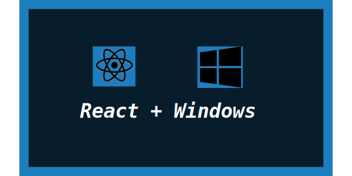
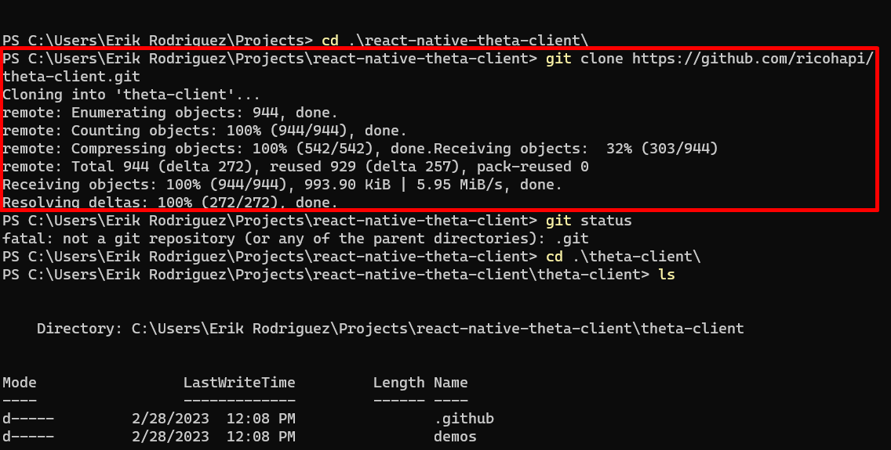

# React Native RICOH THETA Demo Installation Guide for Windows

## Overview

Guide covers the installation process of React Native on **Windows OS** so that we can run the `demo-react-native`. 
Another section will cover the installation for Mac OS. For this installation you will need to install **node.js** if you haven't already. 
Their will be videos and links in the resource section for the installation of node.js on your computer. Article also covers how to build the `theta-client` and make it available to `demo-react-native`. 
As well as building the `demo-react-native` and running it on an android emulator. 
My results will be shown in the article with the **THETA X** running the react native demo app provided by the RICOH API.

## General Steps to run React Native Demo on Windows

1. Build the `theta-client` and make it available to `demo-react-native`
2. Build `demo-react-native`
3. Test the `demo-react-native` build on **THETA X** with an emulator
    
4. Test all demo features : List Files, Take Photo

Resources

* [GITHUB React Native demo for theta-client](https://github.com/ricohapi/theta-client/tree/main/demos/demo-react-native)

* [VIDEO theta-client React Native full build tutorial and demonstration](https://www.youtube.com/watch?v=SqzDomDikcM)

* [VIDEO HowTo Install nvm, node, npm and yarn on Windows 11](https://www.youtube.com/watch?v=NWUfaXFPv50)

## Work Environment

| Dell XPS 13 | Details                              |
| ----------- | ------------------------------------ |
| CPU         | Intel(R) Core(TM) i7-10710U CPU @ 1.10GHz   1.61 GHz  |
| RAM         | 16.0 GB |
| OS          | Windows 11 Home |

# React Native install on Windows

## Requirements
[Android Studio](https://developer.android.com/studio)

## Command Line Steps

First Command - Clone the Repo with `git clone https://github.com/ricohapi/theta-client.git`

Second Command -  Go into  **theta-client** directory with `cd theta-client`

Third Command - Build Gradlew with `./gradlew publishToMavenLocal podPublishXCFramework` but I have an Error, the problem is the SDK location is not found. My solution is to set the environment variable of the SDK.

## Steps to Fix for Build Failure:

1.  Search for env

    

2.  Click on environmental variables

    

3.  New System Variable

    

4.  Type in the Variable name `ANDROID_HOME` and set the path `C:\Users\UserName\AppData\Local\Android\Sdk`

    

By default the path to the SDK usually is `C:\Users\UserName\AppData\Local\Android\Sdk` , Copy the Path substituting for your `UserName` 

5.  Restart your terminal by closing and relaunching it before trying out the `gradlew` build command again

## Command Line Steps Continued

Fourth Command - Try the Build Gradlew command again `./gradlew publishToMavenLocal podPublishXCFramework`

Screenshot below shows its successful

Fifth Command - Set the environment variable of THETA_CLIENT with `setx path "%THETA_CLIENT%;C:\Users\Erik Rodriguez\Projects\theta-client"` substituting for your own path to the directory of **theta-client** which you can get with the `pwd` command 

Sixth Command - Go into **react-native** directory with `cd react-native`