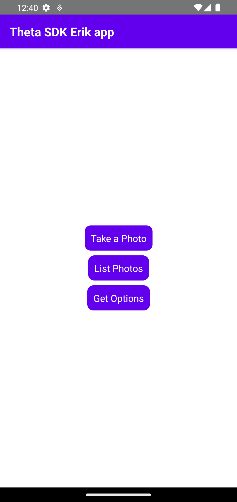

# React Native RICOH THETA Client v1.2 Walkthrough

## Overview

Walks through [RICOH THETA Client v1.2](https://community.theta360.guide/t/theta-client-official-sdk-v1-2-released-with-client-mode-time-shift-previewformat-and-more/9067) and tests out the new features in React Native.

This demonstration has followed the tutorial in [Installation](react-native-install.md) for Initial Setup.

## Starting the Demo

To start the Demo `cd` into the `theta-client/demos/demo-react-native` directory and run these commands in a Terminal

```
yarn install 
yarn run android
```

## Results

| Main Menu | Take Photo   | List Files |
| ----------- | ----------| ---------- |
| { width="250"} | { width="250"}  | { width="250"}|

## Possible Error's During Demo

 Error | Solution                              |
| ----------- | ------------------------------------ |
| Need npm To install Yarn | [Install Node.js](../how-to-install-nodejs)  |
| Yarn not Working | [Install Yarn](../react-native-install/#install-and-run-yarn) |
