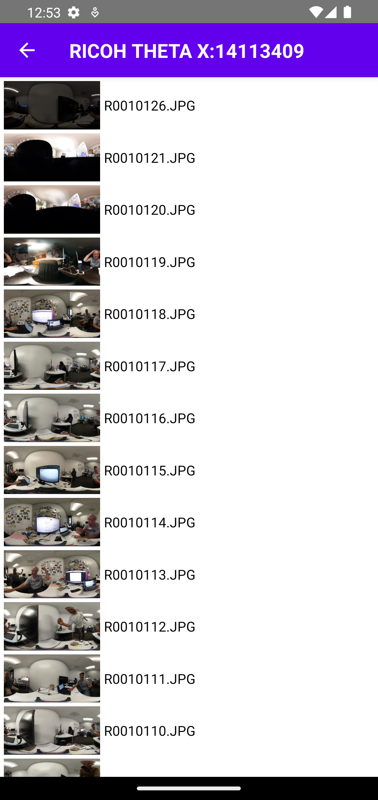

# React Native RICOH THETA Client v1.2 Walkthrough

## Overview

Walks through [RICOH THETA Client v1.2](https://community.theta360.guide/t/theta-client-official-sdk-v1-2-released-with-client-mode-time-shift-previewformat-and-more/9067) and tests out the new features in React Native.

This demonstration has followed the tutorial in [Installation](react-native-install.md) for Initial Setup.

## Starting the Demo

To start the Demo `cd` into the `theta-client/demos/demo-react-native` directory and run these commands in a Terminal

``` linux
yarn install 
yarn run android
```

## Demo Results

| Main Menu | Take Photo   | List Files |
| ----------- | ----------| ---------- |
| { width="250"} | { width="250"}  | { width="250"}|

## Coding Get Options Component

### 1. Create a new `.tsx` file and Import the Necessary Libraries

From the `react` library we utilize `useEffect` and `useState` to help with State Changes and Asynchronous Calls during the API Requests from the RICOH THETA Client SDK.

From the `react-native` library we utilize the `Text` component to show the data as text on screen.

From [`theta-client-react-native`](https://www.npmjs.com/package/theta-client-react-native) library provided by the RICOH SDK we utilize `OptionNameEnum` and `getOptions` to get data from a chosen [list of Options Enumerators available](https://github.com/ricohapi/theta-client/blob/main/react-native/src/theta-repository/options/options.ts).

``` javascript
import React, {useEffect, useState} from 'react';
import {Text} from 'react-native';

import {
  OptionNameEnum,
  getOptions,
} from 'theta-client-react-native';
```

### 2. Create a react component

``` javascript
const GetOptions = ({ navigation }) => {

    // CODE HERE

  return (
        <Text></Text>
    );
};
```

### 3. Use RICOH SDK to get Enum Options and Export Component

I am choosing the 6 new properties released in RICOH THETA Client SDK 1.2.0 that are listed here [1.2.0 Release](https://github.com/ricohapi/theta-client/releases/tag/1.2.0) as my chosen Options. You can get a list of Enumerator Options here [Enums Options](https://github.com/ricohapi/theta-client/blob/main/react-native/src/theta-repository/options/options.ts). Then we export our component. All new changes are highlighted.

``` javascript hl_lines="2-19 26"
const GetOptions = ({ navigation }) => {
  const [optionNames, setOptionNames] = useState([]);

  useEffect(() => {
    const fetchOptions = async () => {
      const result = await getOptions([
        OptionNameEnum.CameraControlSource,
        OptionNameEnum.CameraMode,
        OptionNameEnum.PowerSaving,
        OptionNameEnum.PreviewFormat,
        OptionNameEnum.ShutterSpeed,
        OptionNameEnum.WlanFrequency,
      ]);

      setOptionNames(JSON.stringify(result));
    };

    fetchOptions();
  }, []);

  return (
    <Text>{optionNames}</Text>
  );
};

export default GetOptions;
```

### Final Code Example

[GitHub - Options Button Return Data](https://github.com/AirTechWick/theta-client-1_2/blob/b811686d619867c1c106fbd35361198cf6277b69/demos/demo-react-native/src/GetOptions.tsx)

``` javascript
import React, {useEffect, useState} from 'react';
import {Text} from 'react-native';

import {
  OptionNameEnum,
  getOptions,
} from 'theta-client-react-native';

const GetOptions = ({ navigation }) => {
  const [optionNames, setOptionNames] = useState([]);

  useEffect(() => {
    const fetchOptions = async () => {
      const result = await getOptions([
        OptionNameEnum.CameraControlSource,
        OptionNameEnum.CameraMode,
        OptionNameEnum.PowerSaving,
        OptionNameEnum.PreviewFormat,
        OptionNameEnum.ShutterSpeed,
        OptionNameEnum.WlanFrequency,
      ]);

      setOptionNames(JSON.stringify(result));
    };

    fetchOptions();
  }, []);

  return (
    <Text>{optionNames}</Text>
  );
};

export default GetOptions;
```

## Coding the Get Options Button

### 1. Add a Screen to Navigate to in App.tsx

In the `App.tsx` file, Import your GetOptions Component and then Add a new React Stack Screen component as shown in the highlighted code. When the button is pressed it will Navigate to the new Stack Screen we created.

``` javascript hl_lines="8 32-36"
import React from 'react';
import {NavigationContainer} from '@react-navigation/native';
import {createNativeStackNavigator} from '@react-navigation/native-stack';
import MainMenu from './MainMenu';
import TakePhoto from './TakePhoto';
import ListPhotos from './ListPhotos';
import PhotoSphere from './PhotoSphere';
import GetOptions from './GetOptions';

const Stack = createNativeStackNavigator();

const screenOptions = {
  headerStyle: {
    backgroundColor: '#6200ee',
  },
  headerTintColor: '#fff',
  headerTitleStyle: {
    fontWeight: 'bold',
  },
  headerBackTitle: '',
};

const App = () => {
  return (
    <NavigationContainer>
      <Stack.Navigator screenOptions={screenOptions}>
        <Stack.Screen
          options={{title: 'Theta SDK Erik app'}}
          name="main"
          component={MainMenu}
        />
        <Stack.Screen
          options={{title: 'Get Options'}}
          name="options"
          component={GetOptions}
        />
        <Stack.Screen
          options={{title: 'Take Photo'}}
          name="take"
          component={TakePhoto}
        />
        <Stack.Screen
          options={{title: 'List Photos'}}
          name="list"
          component={ListPhotos}
        />
        <Stack.Screen
          options={{title: 'Sphere'}}
          name="sphere"
          component={PhotoSphere}
        />
        
      </Stack.Navigator>
    </NavigationContainer>
  );
};

export default App;
```

### 2. Add a Button in MainMenu.tsx

In the MainMenu component we create a `goOptions()` function that uses reacts `navigation.navigate()` to go to our `options` screen we created in `App.tsx`. This function is called below in a button press event.

In the `return` we add a View Style Component that just adds top spacing to our new button. Then we add the Button as a `TouchableOpacity` component, when the `onPress` event of the button happens our function `goOptions` is called.

``` javascript hl_lines="14-16 41-44"
import React from 'react';
import {StatusBar, Text, View, TouchableOpacity} from 'react-native';
import {SafeAreaView} from 'react-native-safe-area-context';
import styles from './Styles';
import {initialize} from 'theta-client-react-native';

const MainMenu = ({navigation}) => {
  const goTake = () => {
    navigation.navigate('take');
  };
  const goList = () => {
    navigation.navigate('list');
  };
  const goOptions = () => {
    navigation.navigate('options');
  }
  React.useEffect(() => {
    async function init() {
      const endpoint = 'http://192.168.1.1'
      //const endpoint = 'https://fake-theta.vercel.app' 
      const config = {
        // clientMode: { // Client mode authentication settings
        //   username: 'THETAXX12345678',
        //   password: '12345678',
        // }
      }
      await initialize(endpoint, config);
    }
    init();
  }, []);
  return (
    <SafeAreaView style={styles.container}>
      <StatusBar barStyle="light-content" />
      <TouchableOpacity style={styles.buttonBack} onPress={goTake}>
        <Text style={styles.button}>Take a Photo</Text>
      </TouchableOpacity>
      <View style={styles.spacer} />
      <TouchableOpacity style={styles.buttonBack} onPress={goList}>
        <Text style={styles.button}>List Photos</Text>
      </TouchableOpacity>
      <View style={styles.spacer} />
      <TouchableOpacity style={styles.buttonBack} onPress={goOptions}>
        <Text style={styles.button}>Get Options</Text>
      </TouchableOpacity>

    </SafeAreaView>
  );
};

export default MainMenu;
```

## Test out your Button

| Button for Get Options | Get Options Result |
| ----------- | ---------- |
| { width="250"} | { width="250"} |

## Possible Error's During Demo

 Error | Solution                              |
| ----------- | ------------------------------------ |
| Need npm To install Yarn | [Install Node.js](../how-to-install-nodejs)  |
| Yarn not Working | [Install Yarn](../react-native-install/#install-and-run-yarn) |
