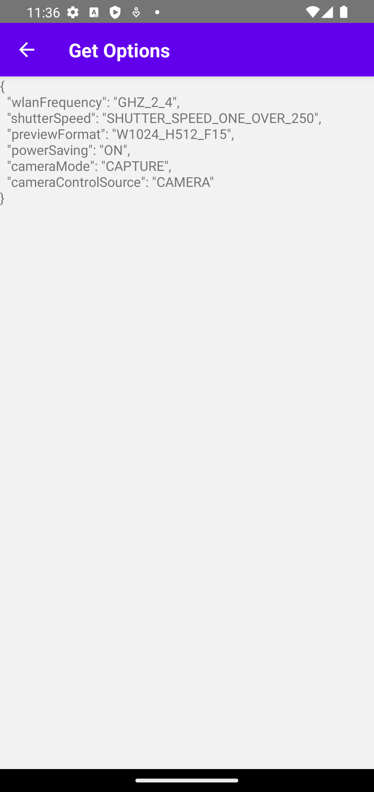

# React Native RICOH THETA Client v1.2 Walkthrough

## Overview

Walks through [RICOH THETA Client v1.2](https://community.theta360.guide/t/theta-client-official-sdk-v1-2-released-with-client-mode-time-shift-previewformat-and-more/9067) and tests out the new features in React Native.

This demonstration has followed the tutorial in [Installation](react-native-install.md) for Initial Setup.

## Starting the Demo

To start the Demo `cd` into the `theta-client/demos/demo-react-native` directory and run these commands in a Terminal

```
yarn install 
yarn run android
```

## Results

| Main Menu | Take Photo   | List Files |
| ----------- | ----------| ---------- |
| { width="250"} | { width="250"}  | { width="250"}|

## Coding Get Options Component

### 1. Create a new `.tsx` file and Import the Necessary Libraries

From the `react` library we utilize `useEffect` and `useState` to help with State Changes and Asynchronous Calls during the API Requests from the RICOH THETA Client SDK.

From the `react-native` library we utilize the `Text` component to show the data as text on screen.

From [`theta-client-react-native`](https://www.npmjs.com/package/theta-client-react-native) library provided by the RICOH SDK we utilize `OptionNameEnum` and `getOptions` to get data from a chosen [list of Options Enumerators available](https://github.com/ricohapi/theta-client/blob/main/react-native/src/theta-repository/options/options.ts).


``` javascript
import React, {useEffect, useState} from 'react';
import {Text} from 'react-native';

import {
  OptionNameEnum,
  getOptions,
} from 'theta-client-react-native';
```

### 2. Create a react component

``` javascript
const GetOptions = ({ navigation }) => {

    // CODE HERE

  return (
        <Text></Text>
    );
};
```

### 3. Use RICOH SDK to get Enum Options and Export Component

``` javascript
const GetOptions = ({ navigation }) => {
  const [optionNames, setOptionNames] = useState([]);

  useEffect(() => {
    const fetchOptions = async () => {
      const result = await getOptions([
        OptionNameEnum.CameraControlSource,
        OptionNameEnum.CameraMode,
        OptionNameEnum.PowerSaving,
        OptionNameEnum.CaptureMode,
      ]);

      setOptionNames(JSON.stringify(result));
    };

    fetchOptions();
  }, []);

  return (
    <Text>{optionNames}</Text>
  );
};

export default GetOptions;
```

### Final Code Example

[GitHub - Options Button Return Data](https://github.com/AirTechWick/theta-client-1_2/blob/b811686d619867c1c106fbd35361198cf6277b69/demos/demo-react-native/src/GetOptions.tsx)

``` javascript
import React, {useEffect, useState} from 'react';
import {Text} from 'react-native';

import {
  OptionNameEnum,
  getOptions,
} from 'theta-client-react-native';

const GetOptions = ({ navigation }) => {
  const [optionNames, setOptionNames] = useState([]);

  useEffect(() => {
    const fetchOptions = async () => {
      const result = await getOptions([
        OptionNameEnum.CameraControlSource,
        OptionNameEnum.CameraMode,
        OptionNameEnum.PowerSaving,
        OptionNameEnum.CaptureMode,
      ]);

      setOptionNames(JSON.stringify(result));
    };

    fetchOptions();
  }, []);

  return (
    <Text>{optionNames}</Text>
  );
};

export default GetOptions;
```

Result

{ width="300"}

## Possible Error's During Demo

 Error | Solution                              |
| ----------- | ------------------------------------ |
| Need npm To install Yarn | [Install Node.js](../how-to-install-nodejs)  |
| Yarn not Working | [Install Yarn](../react-native-install/#install-and-run-yarn) |
