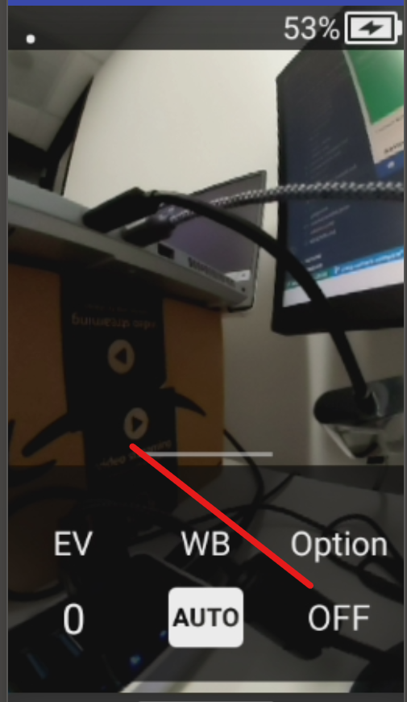
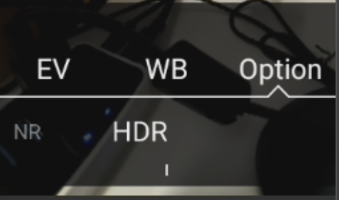
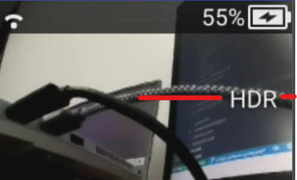

# Verifying Images

The RICOH THETA X can take 11K and 5.5 images.

| model | resolution | width and height | approx megapixels | approx file size |
| ---- | ------- | ------- | --------- | -------- |
| THETA X | 11K |  11008 × 5504 | 60 megapixels | 9MB - 12MB  |
| THETA X | 5.5K | 5504 × 2752 | 15 megapixels | 3.5 - 4.5MB |
| SC2 | 5.4K | 5376×2688 | 14 megapixels | 3 - 4.4MB |

## File Size

You can use the file size to quickly see the expected resolution.

<figure markdown>

<figcaption>THETA X: green is 5.5K and red is 11K
</figcaption>
</figure>

## Windows Properties

On Windows, you can right-click on the image file to see properties.

<figure markdown>

<figcaption>SC2 image properties seen on Windows 11
</figcaption>
</figure>

## metadata

Access image metadata to get detailed information in the image.
This example shows the use of [ExifTool](https://exiftool.org/)
on Windows 11. With the command
`exiftool.exe [name_of_file.JPG]`, the camera model
(RICOH THETA X), firmware version of the camera (1.41.0) and image size (11008x5504)
can quickly be reviewed.

```text
PS C:> exiftool.exe .\R0070093.JPG
ExifTool Version Number         : 12.41
File Name                       : R0070093.JPG
File Size                       : 9.9 MiB
File Type                       : JPEG
File Type Extension             : jpg
MIME Type                       : image/jpeg
Exif Byte Order                 : Big-endian (Motorola, MM)
Make                            : RICOH
Camera Model Name               : RICOH THETA X
Orientation                     : Horizontal (normal)
Software                        : RICOH THETA X Ver 1.41.0
XMP Toolkit                     : RICOH THETA X Ver 1.41.0
Projection Type                 : equirectangular
Use Panorama Viewer             : True
Cropped Area Image Width Pixels : 11008
Cropped Area Image Height Pixels: 5504
Full Pano Width Pixels          : 11008
Full Pano Height Pixels         : 5504
Image Width                     : 11008
Image Height                    : 5504
Encoding Process                : Baseline DCT, Huffman coding
Bits Per Sample                 : 8
Color Components                : 3
Y Cb Cr Sub Sampling            : YCbCr4:2:0 (2 2)
Aperture                        : 2.4
Image Size                      : 11008x5504
Megapixels                      : 60.6
Shutter Speed                   : 1/20
```

## verify HDR

To verify that that image is in HDR, use the _-v_ option for
exiftool and inspect the MakerNotes `Ricoh_ThetaSubdir_0x0002`.

A value of 1 indicates HDR.  A value of 0 indicates non-HDR.

### Example with HDR

`Ricoh_ThetaSubdir_0x0002` is `1`.

```text
PS C:> exiftool.exe -v .\R0070093.JPG
  | | 18) MakerNoteRicoh (SubDirectory) -->
  | | + [MakerNotes directory with 8 entries]
  | | | 0)  MakerNoteType = Rdc
  | | | 1)  FirmwareVersion = 0x00
  | | | 2)  Ricoh_0x0003 = 8580
  | | | 3)  SerialNumber = 14010001
  | | | 4)  RecordingFormat = 255
  | | | 5)  WhiteBalance = 0
  | | | 6)  ColorTempKelvin = 0
  | | | 7)  ThetaSubdir (SubDirectory) -->
  | | | + [MakerNotes directory with 48 entries]
  | | | | 0)  Ricoh_ThetaSubdir_0x0001 = 1
  | | | | 1)  Ricoh_ThetaSubdir_0x0002 = 1
```

### Example with non-HDR

```text
PS C:> exiftool -v .\R0070094.JPG
  | | 18) MakerNoteRicoh (SubDirectory) -->
  | | + [MakerNotes directory with 8 entries]
  | | | 0)  MakerNoteType = Rdc
  | | | 1)  FirmwareVersion = 0x00
  | | | 2)  Ricoh_0x0003 = 8580
  | | | 3)  SerialNumber = 14010001
  | | | 4)  RecordingFormat = 255
  | | | 5)  WhiteBalance = 0
  | | | 6)  ColorTempKelvin = 0
  | | | 7)  ThetaSubdir (SubDirectory) -->
  | | | + [MakerNotes directory with 48 entries]
  | | | | 0)  Ricoh_ThetaSubdir_0x0001 = 1
  | | | | 1)  Ricoh_ThetaSubdir_0x0002 = 0
```

## Camera Body Screen

HDR is off. Swipe up from the bottom of screen to see this menu.
Use a partial swipe.  A full swipe will show a different menu.

<figure markdown>

<figcaption>THETA X is not in HDR
</figcaption>
</figure>


On the camera screen, HDR is set with Option.


<figcaption>HDR can be set touchscreen in addition to API
</figcaption>
</figure>

When HDR is enabled, the letters _HDR_ will appear on the
screen.


<figcaption>HDR is enabled
</figcaption>
</figure>
